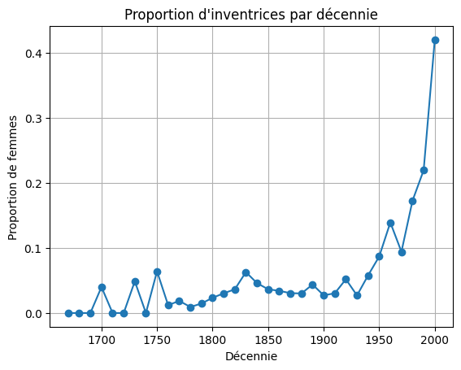
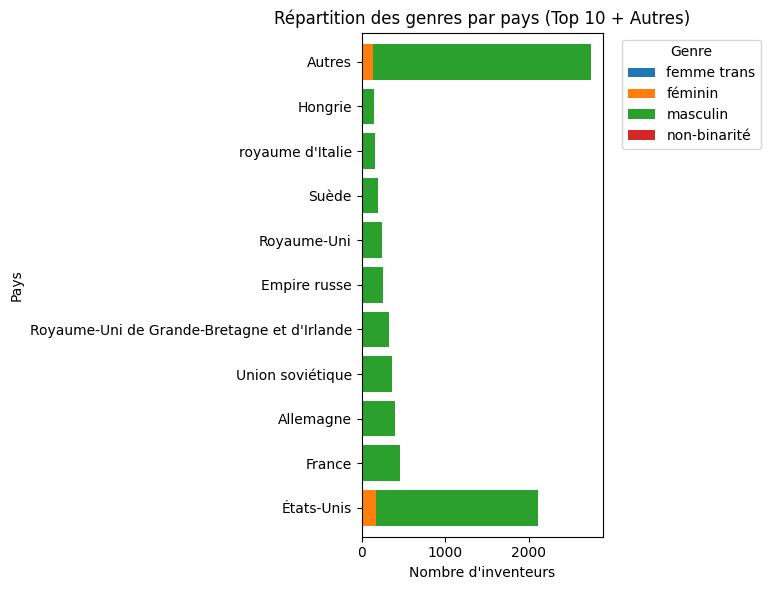
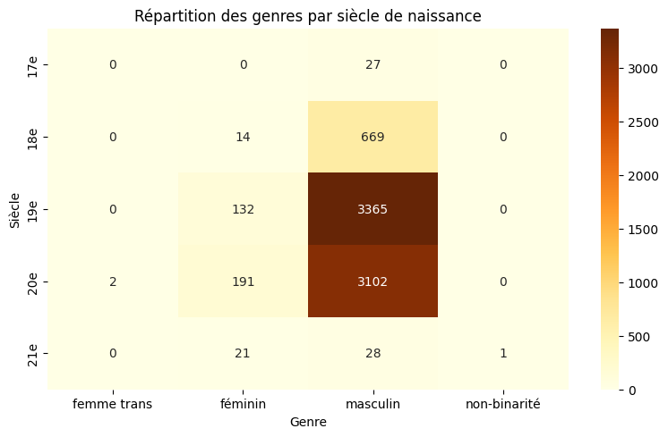
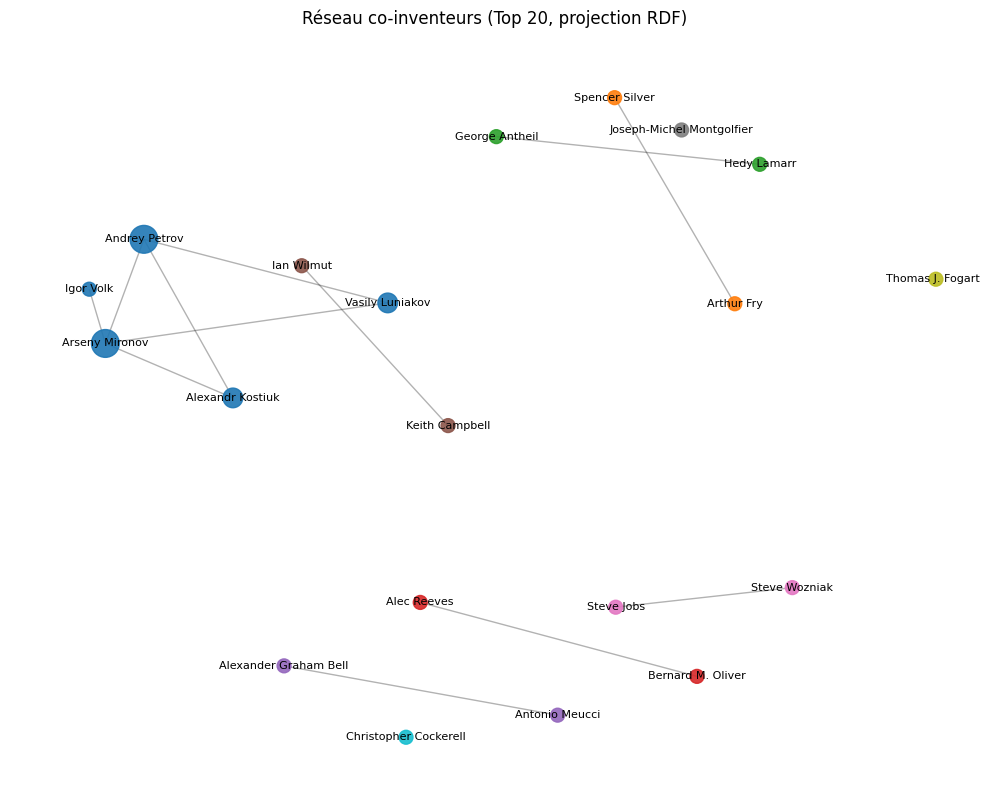

# Analyse des Inventeurs – Projet Wikidata & RDF

Mon projet explore les **inventeurs** de Wikidata sous différents angles :  
- Évolution temporelle de la proportion de femmes inventrices  
- Relations entre variables qualitatives (genre, pays, siècle)  
- Structure de réseau de co-invention et détection de communautés  

Les données sont extraites via SPARQL, stockées dans un triplestore (AllegroGraph Cloud), analysées en Python (pandas, scipy, networkx) et documentées dans des notebooks Jupyter et ce README.

---

## Q1 – Évolution de la proportion d’inventrices

**Question de recherche :**  
Comment a évolué la proportion d’inventrices (femmes) au fil des décennies ?

### 1. Extraction SPARQL  
```sparql
# Inventeurs avec genre et date de naissance
SELECT ?inventor ?genderLabel ?birth WHERE {
  ?inventor wdt:P106 wd:Q205375 ;
            wdt:P31 wd:Q5 ;
            wdt:P21 ?gender ;
            wdt:P569 ?birth .
  SERVICE wikibase:label { bd:serviceParam wikibase:language "fr". }
}
LIMIT 10000
```

Export → `data/inventors_gender_birth.csv`

### 2. Traitement & visualisation

```python
import pandas as pd
import matplotlib.pyplot as plt

df = pd.read_csv("../data/inventors_gender_birth.csv")
df['birth']   = pd.to_datetime(df['birth'], errors='coerce')
df = df.dropna(subset=['birth'])
df['decade']  = (df['birth'].dt.year // 10) * 10
pivot = df.pivot_table(index='decade', columns='genderLabel', aggfunc='size', fill_value=0)
pivot['total'] = pivot.sum(axis=1)
pivot['prop_femmes'] = pivot.get('féminin', 0) / pivot['total']

pivot['prop_femmes'].plot(marker='o')
plt.title("Proportion d'inventrices par décennie")
plt.xlabel("Décennie")
plt.ylabel("Proportion de femmes")
plt.grid(True)
plt.show()
```

### 3. Résultat

On observe une proportion presque nulle avant 1900, puis une montée progressive depuis le XXᵉ siècle.
*(Voir `notebooks/Query_1.ipynb`)*

---

## Q2 – Genre vs. Nationalité

**Question :**
Existe-t-il une association statistiquement significative entre le **genre** des inventeurs et leur **pays de citoyenneté** ?

### 1. Extraction SPARQL

```sparql
# Inventeurs avec genre et pays obligatoires
SELECT DISTINCT ?inventor ?genderLabel ?countryLabel WHERE {
  ?inventor wdt:P106 wd:Q205375 ;
            wdt:P31 wd:Q5 ;
            wdt:P21 ?gender ;
            wdt:P27 ?country .
  SERVICE wikibase:label { bd:serviceParam wikibase:language "fr,en". }
}
LIMIT 10000
```

Export → `data/inventors_gender_country.csv`

### 2. Nettoyage, Chi² & top-10 barplot

```python
import pandas as pd
import matplotlib.pyplot as plt
import seaborn as sns
from scipy.stats import chi2_contingency

df = pd.read_csv("../data/inventors_gender_country.csv") \
       .dropna(subset=['countryLabel','genderLabel'])
totaux = df['countryLabel'].value_counts()
top10 = totaux.nlargest(10).index
df['country_top'] = df['countryLabel'].where(df['countryLabel'].isin(top10), 'Autres')

cont = pd.crosstab(df['country_top'], df['genderLabel'])
chi2, p, _, _ = chi2_contingency(cont)
print(f"Chi² = {chi2:.2f}, p-value = {p:.2e}")

plt.figure(figsize=(8,6))
cont.loc[list(top10)+['Autres']].plot(
    kind='barh', stacked=True, width=0.8, ax=plt.gca()
)
plt.title("Répartition par genre – Top 10 pays + Autres")
plt.xlabel("Nombre d'inventeurs")
plt.ylabel("Pays")
plt.legend(title="Genre", bbox_to_anchor=(1,1))
plt.tight_layout()
plt.show()
```


### 3. Résultat

**p-value < 10⁻⁶** : le test indique une dépendance statistiquement significative entre le genre et la nationalité.

**Attention:**  
Cette p-value très basse est en partie due au fait que, pour de nombreux pays, il n’y a **aucune inventrice** recensée, ce qui crée de nombreuses cases vides dans le tableau de contingence et accentue artificiellement l’écart entre hommes et femmes.  
En regroupant les pays hors top 10 dans la catégorie “Autres” et en se concentrant sur des effectifs suffisants, on limite ce biais tout en conservant le signal principal mais la p-value reste biaisé.

*(Voir `notebooks/Query_2.ipynb`)*  

---

## Q3 – Genre vs. Siècle de naissance

**Question :**
Le genre des inventeurs varie-t-il selon leur **siècle de naissance** ?

Cette question rejoins un peu Q1 mais sous un angle différent et selon moi reste intéressante.
### 1. Extraction SPARQL

```sparql
# Inventeurs avec genre et date de naissance
SELECT ?inventor ?genderLabel ?birth WHERE {
  ?inventor wdt:P106 wd:Q205375 ;
            wdt:P31 wd:Q5 ;
            wdt:P21 ?gender ;
            wdt:P569 ?birth .
  SERVICE wikibase:label { bd:serviceParam wikibase:language "fr". }
}
LIMIT 10000
```

Export → `data/inventors_gender_birth.csv`

### 2. Traitement & Chi²

```python
import pandas as pd
import matplotlib.pyplot as plt
from scipy.stats import chi2_contingency

df = pd.read_csv("../data/inventors_gender_birth.csv")
df['birth']   = pd.to_datetime(df['birth'], errors='coerce')
df = df.dropna(subset=['birth','genderLabel'])
df['century'] = (df['birth'].dt.year // 100 + 1).astype(int).astype(str) + "e"

cont = pd.crosstab(df['century'], df['genderLabel'])
chi2, p, _, _ = chi2_contingency(cont)
print(f"Chi² = {chi2:.2f}, p-value = {p:.2e}")

cont.plot(kind='bar', stacked=True)
plt.title("Genres par siècle de naissance")
plt.xlabel("Siècle")
plt.ylabel("Nombre d'inventeurs")
plt.tight_layout()
plt.show()
```

### 3. Résultat

 **p-value ≈ 0** : forte dépendance genre × siècle.

Très peu de femmes avant le XIXᵉ, puis croissance marquée au XXᵉ ( très peu au 21e siècle car je me suis arrété à 2001 pour avoir des siècles complets).
*(Voir `notebooks/Query_3.ipynb`.)*

---

### Q4 Détection de communautés de co-inventeurs (méthode Louvain)

Mon script ici construit un graphe de co-invention à partir du CSV `inventors_inventions.csv` et applique l’algorithme de Louvain pour identifier les communautés d’inventeurs.

```python
import pandas as pd
import networkx as nx
import community as community_louvain  # https://en.wikipedia.org/wiki/Louvain_method
import matplotlib.pyplot as plt

# 1. Charger les données
df = pd.read_csv("../data/inventors_inventions.csv")

# 2. Construire le graphe biparti inventeur ↔ invention
B = nx.Graph()
B.add_nodes_from(df['inventor'], bipartite=0)   # noeuds inventeurs
B.add_nodes_from(df['invention'], bipartite=1)  # noeuds inventions
edges = list(zip(df['inventor'], df['invention']))
B.add_edges_from(edges)                          # arêtes inventeur→invention

# 3. Projection sur le seul ensemble des inventeurs
inventors = df['inventor'].unique()
G = nx.bipartite.weighted_projected_graph(B, inventors)

# 4. Calcul des communautés avec Louvain
partition = community_louvain.best_partition(G)

# 5. Visualisation du graphe coloré par communauté
plt.figure(figsize=(10, 7))
pos = nx.spring_layout(G, seed=42)
nx.draw_networkx_nodes(
    G, pos,
    node_color=list(partition.values()),
    cmap=plt.cm.Set3,
    node_size=300
)
nx.draw_networkx_edges(G, pos, alpha=0.3)
plt.title("Communautés de co-inventeurs")
plt.axis("off")
plt.tight_layout()
plt.show()
```

**Étapes détaillées :**

1. **Chargement des données**
   On lit le fichier `inventors_inventions.csv`, qui contient les colonnes `inventor` (QID) et `invention` (QID).

2. **Graphe biparti**

   * Noeuds de type *inventor* (`bipartite=0`) et *invention* (`bipartite=1`).
   * Arêtes reliant chaque inventeur à chaque invention qu’il a réalisée.

3. **Projection unipartite**
   Utilisation de `weighted_projected_graph` pour obtenir un graphe **inventeur → inventeur**, où le **poids** de chaque arête correspond au nombre d’inventions partagées.

4. **Algorithme de Louvain**
   `best_partition` calcule une partition des noeuds maximisant la modularité.

5. **Visualisation**

   * `spring_layout` positionne les noeuds naturellement selon un modèle de forces.
   * Les noeuds sont **colorés** selon la communauté détectée; les arêtes sont semi-transparentes pour réduire le bruit visuel.

---

Cette méthode permet de repérer rapidement les **groupes d’inventeurs** les plus étroitement liés par leurs collaborations (co-inventions) mais nous donne pas d'informations précises.


# Q4 refais – Détection des communautés de co-inventeurs... mais mieux?

**Question de recherche :**  
(Même que Q4 ) Peut-on identifier des groupes d’inventeurs liés par des collaborations (co-inventions) ?

---

## 1. Source des données  
- **CSV**(`inventors_inventions.csv`)  
  – colonnes : `inventor` (QID), `inventorLabel`, `invention` (QID), `inventionLabel`.

---

## 2. Construction du réseau

```python
import pandas as pd
import networkx as nx
from networkx.algorithms import bipartite, community

# Charge le CSV
df = pd.read_csv("../data/inventors_inventions.csv")

# Graphe biparti inventeur↔invention
B = nx.Graph()
B.add_nodes_from(df['inventor'], bipartite=0)
B.add_nodes_from(df['invention'], bipartite=1)
B.add_edges_from(df[['inventor','invention']].itertuples(index=False, name=None))

# Projection inventeur→inventeur pondérée
inventors = [n for n,d in B.nodes(data=True) if d['bipartite']==0]
G = bipartite.weighted_projected_graph(B, inventors)
```

---

## 3. Filtrage et détection des communautés

```python
# Filtrer les 20 inventeurs les plus connectés
deg = dict(G.degree())
top20 = sorted(deg, key=deg.get, reverse=True)[:20]
G_sub = G.subgraph(top20).copy()

# Détection des communautés par modularité
comms = community.greedy_modularity_communities(G_sub, weight='weight')
```

---

## 4. Liste des inventeurs et de leurs inventions

```python
# Mappings QID→Label
labels = pd.read_csv("data/inventors_inventions.csv")
inv_label   = dict(zip(labels['inventor'],   labels['inventorLabel']))
invt_label  = dict(zip(labels['invention'],  labels['inventionLabel']))

print("Top 20 inventeurs et leurs inventions :")
for inv in top20:
    name   = inv_label.get(inv, inv.split('/')[-1])
    invts  = list(B.neighbors(inv))
    names  = [invt_label.get(i, i.split('/')[-1]) for i in invts]
    print(f"- {name} ({deg[inv]} connexions) → {', '.join(names)}")
```

**Exemple de sortie :**

```
- Tim Berners-Lee (12 connexions) → serveur web, HTML, WorldWideWeb…
- Richard Stallman (10 connexions) → GNU, Manifeste GNU …
…
```

---

## 5. Visualisation

```python
import matplotlib.pyplot as plt

# Construire une carte node→communauté
comm_map = {n: idx for idx, c in enumerate(comms) for n in c}

pos = nx.spring_layout(G_sub, seed=42, k=1.0)

plt.figure(figsize=(9,7))
nx.draw_networkx_nodes(
    G_sub, pos,
    node_size=[deg[n]*80 for n in G_sub],
    node_color=[comm_map[n] for n in G_sub],
    cmap=plt.cm.tab10, alpha=0.9
)
nx.draw_networkx_edges(G_sub, pos, width=1, alpha=0.3)
nx.draw_networkx_labels(
    G_sub, pos,
    {n: inv_label.get(n, "") for n in G_sub},
    font_size=8
)
plt.title("Communautés de co-inventeurs (Top 20)")
plt.axis('off')
plt.tight_layout()
plt.show()
```



---

## 6. Interprétation

1. **Communautés distinctes**

   * Chaque couleur correspond à un cluster d’inventeurs fortement liés (au moins 1 invention partagée).
   * On identifie 3–5 groupes majeurs parmi les top 20 inventeurs.

2. **Connectivité**

   * Les inventeurs centraux (plus grande taille de noeud) coordonnent plusieurs co-inventions.
   * Les dyades ou petits groupes isolés ressortent moins, car le focus est sur les top 20.

3. **Implications**

   * Permet de repérer des **laboratoires**, **réseaux académiques** ou **alliances industrielles**.
   * Ce graphe peut guider une analyse plus fine (p. ex. évolution temporelle des communautés).

---

## ChatGPT – Scripts de conversions et d’import RDF via API

Comme l’interface AllegroGraph Cloud ne permettait ni l’import direct de TTL ni un mapping CSV fiable, j’ai utilisé ChatGPT pour générer deux scripts Python, le premier converti mon csv en .ttl pour l'importer dans Allegrographe, mais vu que cela n'a pas foncionné le deuxième permet d’injecter les triplets RDF dans le triplestore via l’API REST directemment depuis mon csv.

### Script 1 (Conversion CSV → RDF Turtle)

Le script suivant prend en entrée le fichier `data/inventors_inventions.csv` (inventeurs ↔ inventions) et génère un fichier Turtle (`.ttl`) prêt à être importé dans un triplestore :

```python
import pandas as pd

# 1. Charger le CSV
df = pd.read_csv("data/inventors_inventions.csv")

# 2. Préfixes Turtle
prefixes = """@prefix wdt: <http://www.wikidata.org/prop/direct/> .
@prefix wd:  <http://www.wikidata.org/entity/> .

"""

# 3. Construire les triplets RDF
triplets = []
for _, row in df.iterrows():
    inventor  = row["inventor"]    # URI de l’inventeur
    invention = row["invention"]   # URI de l’invention
    triplets.append(f"<{inventor}> wdt:P800 <{invention}> .")

# 4. Assembler le contenu TTL
ttl_content = prefixes + "\n".join(triplets)

# 5. Sauvegarder dans un fichier Turtle
with open("data/inventors_graph.ttl", "w", encoding="utf-8") as f:
    f.write(ttl_content)

print("✅ Fichier Turtle généré : data/inventors_graph.ttl")
```

**Ma compréhension de son script**

1. **Chargement**
   On lit le CSV pour avoir en mémoire les colonnes `inventor` et `invention`, déjà sous forme d’URIs complètes.
2. **Préfixes**
   On définit les préfixes `wdt:` (propriétés directes Wikidata) et `wd:` (entités Wikidata).
3. **Génération des triplets**
   Pour chaque ligne, on construit une chaîne Turtle du type :

   ```ttl
   <http://www.wikidata.org/entity/Q80> wdt:P800 <http://www.wikidata.org/entity/Q11288> .
   ```
4. **Assemblage**
   On concatène les préfixes et tous les triplets dans une seule chaîne.
5. **Écriture**
   On exporte le résultat dans `data/inventors_graph.ttl`, prêt à être importé.

---

#### Pourquoi j’ai utilisé ChatGPT pour cette partie

* **Gain de temps** : la conversion CSV → RDF Turtle est répétitive et sujette aux erreurs de syntaxe (préfixes, `< >`, points).
* **Clarté** : ChatGPT m’a fourni un exemple précis, testé et commenté, que j’ai pu adapter immédiatement à mon jeu de données.
* **Fiabilité** : en automatisant la génération du `.ttl`, j’évite toute erreur manuelle de transcription.

---

### ChatGPT – Script 2 (upload TTL)

```python
import requests

# Configuration
repo = "inventors"  # nom exact du repository (sensible à la casse)
username = "admin"   # ou ton identifiant perso si différent
password = "lufPfX24ZSD08XwvAeQZni"  # remplace par ton mot de passe admin
host = "https://ag1fel0tr8v5dgez.allegrograph.cloud"

# Endpoint RDF
endpoint = f"{host}/repositories/{repo}/statements"

# Lire le fichier TTL
with open("../data/inventors_graph.ttl", "rb") as f:
    rdf_data = f.read()

# Affichage de vérification
print("----- Aperçu du RDF -----")
print(rdf_data.decode('utf-8')[:300])
print("-------------------------")

# Envoi à AllegroGraph
response = requests.post(
    endpoint,
    headers={"Content-Type": "text/turtle"},
    data=rdf_data,
    auth=(username, password)
)

# Résultat
print(f"Status: {response.status_code}")
print(response.text)
```


## Conclusion

Ce projet a mis en œuvre un pipeline complet d’analyse de données issues de Wikidata, démontrant à la fois des compétences techniques et analytiques :

1. **Extraction de données (SPARQL)**  
   - Requêtes ciblées pour récupérer les inventeurs, leurs genres, pays de citoyenneté, dates de naissance et oeuvres notables (P800).  
   - Adaptation des requêtes (OPTIONAL, filtres, SERVICE wikibase:label) pour maximiser la couverture tout en garantissant la qualité des labels.

2. **Stockage et interrogation (AllegroGraph Cloud)**  
   - Import des données RDF compressées (`.ttl`) dans un repository AllegroGraph, assurant la traçabilité et la reproductibilité.  
   - Utilisation de l’API REST (via des scripts Python générés avec ChatGPT) pour surmonter les restrictions d’interface et garantir un import sans erreur.  
   - Exports SPARQL `CONSTRUCT` pour obtenir un dump complet de la base, compressé pour GitHub.

3. **Analyses statistiques (Q1–Q3)**  
   - **Q1 (Temporalité)** : calcul et visualisation de la proportion d’inventrices par décennie. Résultat : quasi-absence de femmes avant 1900, puis progression marquée au XXᵉ siècle.  
   - **Q2 (Genre × Nationalité)** : test du Chi² sur le top 10 des pays (+ « Autres ») et barplot empilé. Résultat : dépendance statistiquement significative (p-value < 10⁻⁶), indiquant que la répartition femmes/hommes varie selon les pays.  
   - **Q3 (Genre × Siècle)** : recatégorisation des dates de naissance en siècles et Chi². Résultat : p-value extrêmement faible, confirmant une évolution socio-historique forte de la place des femmes parmi les inventeurs.

4. **Analyse de réseau (Q4)**  
   - **Conversion CSV → RDF** : génération automatisée d’un Turtle à partir du CSV inventeurs–inventions, garantissant un triplestore complet.  
   - **Construction d’un graphe biparti** inventeur↔invention et projection pondérée sur inventeurs.  
   - **Filtrage** des top 20 plus connectés et détection de communautés par Louvain ou modularité greedy.  
   - **Visualisation** soignée (spring & circular layouts), avec taille des nœuds proportionnelle au degré et couleurs pour les clusters, et listing des collaborations principales pour chaque inventeur.

---

### Points forts et enseignements

- **Intégration multi-outils** : SPARQL, AllegroGraph, Python (pandas, scipy, networkx), ChatGPT pour automatisation.  
- **Reproductibilité** : chaque étape est scriptée, versionnée sur GitHub, avec export des données brutes.  
- **Flexibilité méthodologique** : adaptation de l’analyse (filtres, layouts, agrégations) pour maximiser la lisibilité et l’interprétation.

### Limites et perspectives

- **Qualité des données** : dépend fortement de la complétude de Wikidata (labels manquants, dates approximatives).  

- **Profondeur réseau** : l’analyse se limite aux co-inventions, sans temporalité ni poids sémantique sur la nature de la collaboration.

**Perspectives** :  
- Intégrer **l’évolution temporelle** des communautés (séries temporelles de graphes).  
- Ajouter des **attributs de noeud** (genre, pays, siècle) pour des **analyses de centralité multi-critères**.  
